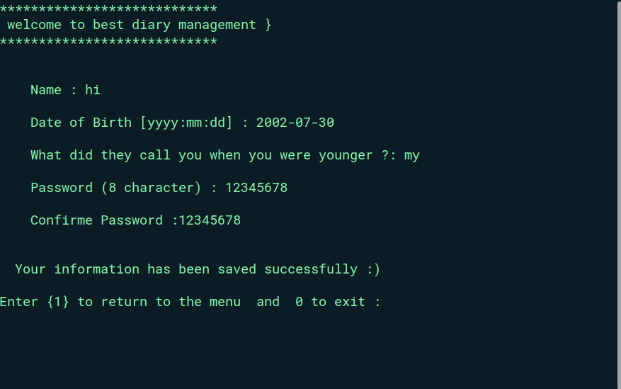

<!-- @format -->

# Diary Management Project

## Screenshots




## Description

The Diary Management Project is a digital platform
designed to help users manage their daily diary entries securely and efficiently.

## Features

- **Create Diary Entries**: Easily create and store daily diary entries with timestamps.
- **Edit Entries**: Modify your existing diary entries to correct or update information.
- **Delete Entries**: Remove outdated or unnecessary entries from your diary.
- **Secure Login**: User authentication ensures that only authorized users can access their diary.

## Installation

1. **Clone the Repository**:
   ```bash
   git clone https://github.com/yourusername/diary-management.git
   cd diary-management
   ```

## Technologies

- C Language
